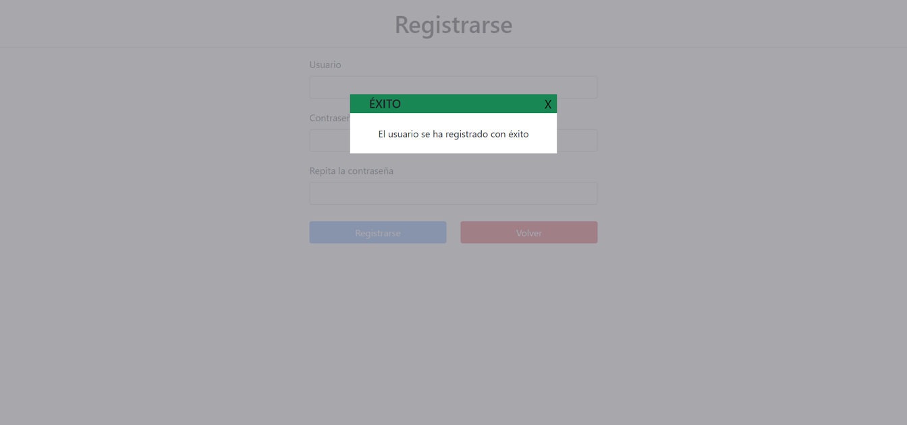

# Práctica Desarrollo Frontend Con JS
---

## Enunciado

- Crear un frontend que debe contar con las siguientes páginas y funcionalidades:

## Requisitos Obligatorios
---

***Listado de anuncios***

- Página principal donde se encontrarán los anuncios. Cada anuncio presetará, foto (si tiene), nombre del artículo, precio y si es compra o venta.
    - Los anuncios deberán cargarse desde el backend
    - Se deben gestionar todos los estados de interfaz correctamente:
        - Vacío, sin anuncios
        - Error, cuando se produce un error al cargar los anuncios
        - Carga, mientras se cargan los anuncios
        - Éxito, cuando se recuperan los anuncios y se muestran
    - Al pulsar sobre un anuncio, se deberá enviar al usuario a la página de **detalle de un anuncio**
    - Si el usuario está atuenticado, se deberá permitir crear un anuncio que, al pulsarlo, deberá llevar a la **página para crear un anuncio**

***Creación de anuncio***

- Se deberá mostrar al usuario un formulario con ls siguientes campos:
    - Foto (opcional): permitirá subir una foto del anuncio
    - Nombre (obligatorio): nombre del artículo
    - Precio (obligatorio): precio del artículo
    - Compra/Venta (obligatorio): indica si se trata de compra o venta
- Cundo el suario envíe el formulario, deberá enviar al backend una petición para guardar el anuncio.
- Se deberá gestionar todos los estados de interfaz correctamente:
    - Error, cuando se produce un error al guardar la información del anuncio
    - Carga, mientras se guarda la información en el backend
    - Éxito, cuando se ha guardado correctamente la información

***Login***

- Deberá mostrar un formulario solicitando el nombre de usuario y la contraseña.
- Cuando el usuario envie el formulario, deberá autenticar al usuario contra el backend para obtener un token JWT que será utilizado en las siguientes comunicaciones con el backend para autenticar al usuario
- Se deberá gestionar todos los estados de interfaz correctamente, carga, error y éxito

***Registro***

- Deberá mostrar un formulario solicitando el nombre de usuario y contraseña
- Cuando el usuario envíe el formulario, deberá registrar al usuario en el backend
- Se deberá gestionar todos los estados de interfaz correctamente, carga, error y éxito

## Requisitos Opcionales
---

- Implementar un buscador de anuncios en el listado
- Permitir editar un anuncio, sólo si el usuario autenticado es el propietario del anuncio
- Permitir el filtrado de anuncios usando tags. Por lo que en el formulario de anuncio deberán poder incluirse tags de los mismos. Estos tags inicialmente pueden ser estáticos (siempre los mismos)
- Unido al anterior, hacer que los tags sean dinámicos

## Restricciones

- Todo el desarrollo deberá realizarse usando Vanilla JavaScript, no se permite el uso de librerias ni frameworks.

- Si está permitido el uso de librerías o frameworks CSS

## Fake Backend

- El backend que se usará será [sparrest.js](https://github.com/kasappeal/sparrest.js) basado en [json-server](https://github.com/typicode/json-server)
---

## Como ejecutar

#### Importante!
> Debemos tener una (o ambas) de estas extensiones ***BrowserSync*** o ***Live server*** en VSC para el correcto funcionamiento del repositorio. 
    
- Para ejecutar correctamente la práctica debemos, primeramente, clonar éste repositorio y seguidamente clonar también [sparrest.js](https://github.com/kasappeal/sparrest.js) (no clonar ambos repositorios en la misma carpeta). Una vez clonados ambos repositorios, pasaremos a configurar el backend.

- Accedemos al backend de **sparrest** y ejecutamos `npm i` para instalar las dependencias. Una vez instalamos las dependencias, accedemos a éste repositorio y copiamos el archivo **db.json** y lo introducimos en el directorio raíz de **sparrest**. 

- Pasamos a iniciar nuestro backend haciendo `npm start`, el cual nos creará en servidor en el puerto **8000**

- Volvemos a éste repositorio y podemos ejecutar cualquiera de las extensiones antes mencionadas sobre las páginas existentes.

---

## Listado de Páginas

#### Index
- Sin usuario registrado y sin anuncios

- Usuario registrado, sin anuncios

- Sin usuario registrado, con anuncios

- Usuario registrado, con anuncios

---

#### Registro
- Campos correctos

- Registro con éxito

- Campos incorrectos

- Contraseñas no coinciden

---

#### Inicio Sesión
- Inicio sesión con éxito

- Campos vacíos

- Usuario/Contraseña incorrecto

